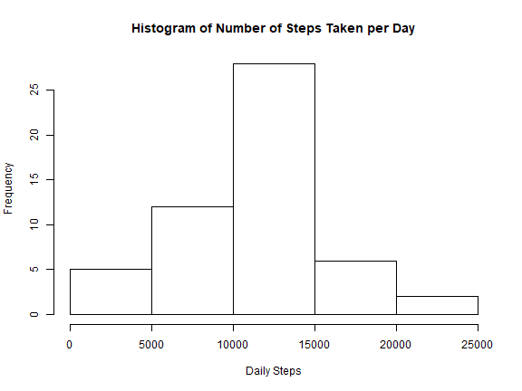
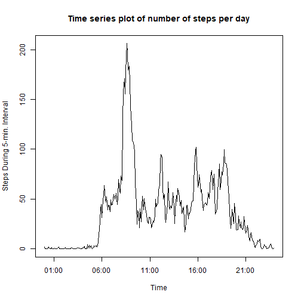
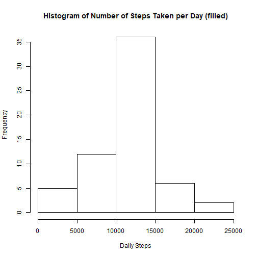
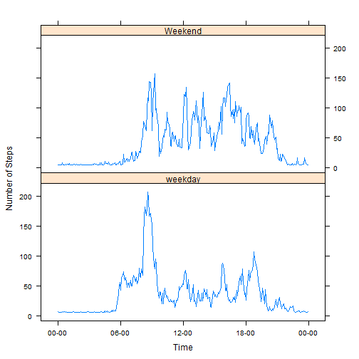

#### Data Loading and Preprocessing :-


```r
setwd("C:/Users/Mike/Dropbox/MOOC/R Programming/RR/R_R_files/RepData_PeerAssessment1")
unzip('activity.zip')
Raw_Data <- read.csv('activity.csv')
```
#### Data Transform:-


```r
TempExtraDigit <- sprintf("%04d", Raw_Data$interval)
Raw_Data <- mutate(Raw_Data, interval = format(strptime(TempExtraDigit, format="%H%M"), format = "%H:%M"))
```


```r
DateSteps <- with(Raw_Data, tapply(steps, date, sum))
AverageDailySteps <- mean(DateSteps, na.rm = TRUE)
```

The average (mean) number of steps taken per day is 10766.1886792.


```r
TotalStepsPerDay_complete <- DateSteps[complete.cases(DateSteps)]
TotalStepsPerDay_complete
```

```
## 2012-10-02 2012-10-03 2012-10-04 2012-10-05 2012-10-06 2012-10-07 
##        126      11352      12116      13294      15420      11015 
## 2012-10-09 2012-10-10 2012-10-11 2012-10-12 2012-10-13 2012-10-14 
##      12811       9900      10304      17382      12426      15098 
## 2012-10-15 2012-10-16 2012-10-17 2012-10-18 2012-10-19 2012-10-20 
##      10139      15084      13452      10056      11829      10395 
## 2012-10-21 2012-10-22 2012-10-23 2012-10-24 2012-10-25 2012-10-26 
##       8821      13460       8918       8355       2492       6778 
## 2012-10-27 2012-10-28 2012-10-29 2012-10-30 2012-10-31 2012-11-02 
##      10119      11458       5018       9819      15414      10600 
## 2012-11-03 2012-11-05 2012-11-06 2012-11-07 2012-11-08 2012-11-11 
##      10571      10439       8334      12883       3219      12608 
## 2012-11-12 2012-11-13 2012-11-15 2012-11-16 2012-11-17 2012-11-18 
##      10765       7336         41       5441      14339      15110 
## 2012-11-19 2012-11-20 2012-11-21 2012-11-22 2012-11-23 2012-11-24 
##       8841       4472      12787      20427      21194      14478 
## 2012-11-25 2012-11-26 2012-11-27 2012-11-28 2012-11-29 
##      11834      11162      13646      10183       7047
```

#### Histogram of the total number of steps taken each day:-


```r
hist(TotalStepsPerDay_complete, xlab = 'Daily Steps',
     main = "Histogram of Number of Steps Taken per Day")
```




The mean number of steps taken per day is 10766.2 and the median value is 10765.

#### Average daily activity pattern:-


```r
TimeSteps <- with(Raw_Data, tapply(steps, interval, mean, na.rm=TRUE))
plot(strptime(row.names(TimeSteps), format = "%H:%M"),TimeSteps,type="l",
     xlab = 'Time', ylab='Steps During 5-min. Interval',
main = "Time series plot of number of steps per day")
```



Which 5-minute interval, on average across all the days in the dataset, contains the maximum number of steps?

The 5-minute interval, on average across all the days in the dataset, which contained the maximum number of steps was at 08:35.

#### Input missing values:-


The number of rows with missing values is 2304.

Devise a strategy for filling in all of the missing values in the dataset: - 

New dataset that is equal to the original dataset but with the missing data filled in: -


```r
filled_data <- Raw_Data
filled_data[complete.cases(filled_data) == FALSE, ]$steps <- mean(filled_data$steps, na.rm=TRUE)
```

Histogram of the total number of steps taken each day: -


```r
FilledDateSteps <- with(filled_data, tapply(steps, date, sum))
```

The mean number of steps taken per day when the filled data is used is 10766.2 compared to 10766.2 for the unfilled data. The median value of the filled data was 10766.2 compared to  10765 for the unfilled data. The values are very similar and the missing data seems to have little impact on the results obtained.


```r
hist(FilledDateSteps, xlab = 'Daily Steps',
     main = "Histogram of Number of Steps Taken per Day (filled)")
```




#### Differences in activity patterns between weekdays and weekends: -


```r
filled_data <- mutate(filled_data, DayOfWeek = weekdays(as.Date(date)))
filled_data <- mutate(filled_data, DayType = factor(filled_data$DayOfWeek == 'Saturday' 
                           | filled_data$DayOfWeek == 'Sunday', 
                           labels = c('Weekday', 'Weekend')))
```


Panel plot containing a time series plot (i.e. type = "l") of the 5-minute interval (x-axis) and the average number of steps taken, averaged across all weekday days or weekend days (y-axis): - 


```r
WeekendData <- filled_data[filled_data$DayType=='Weekend',]
Weekend <- with(WeekendData, tapply(steps, interval, mean, na.rm=TRUE))
WeekendFrame <- data.frame(Weekend)
WeekendFrame$DayType = as.factor('Weekend')
WeekendFrame <- rename(WeekendFrame, steps = Weekend)
WeekendFrame <- mutate(WeekendFrame, interval = row.names(WeekendFrame))

WeekdayData <- filled_data[filled_data$DayType=='Weekday',]
Weekday <- with(WeekdayData, tapply(steps, interval, mean, na.rm=TRUE))
WeekdayFrame <- data.frame(Weekday)
WeekdayFrame$DayType = as.factor('weekday')
WeekdayFrame <- rename(WeekdayFrame, steps = Weekday)
WeekdayFrame <- mutate(WeekdayFrame, interval = row.names(WeekdayFrame))

sorted <- rbind(WeekdayFrame, WeekendFrame)
```


```r
xyplot(steps~as.POSIXct(strptime(interval, format = "%H:%M"))|factor(DayType),
       sorted,
       scales=list(x=list(format="%H-%M")),
       type='l',
       layout=c(1,2),
       xlab='Time',ylab='Number of Steps')
```



It looks like people are more active in the at about 09:00 on weekdays compared to weekends.
knit2html()
